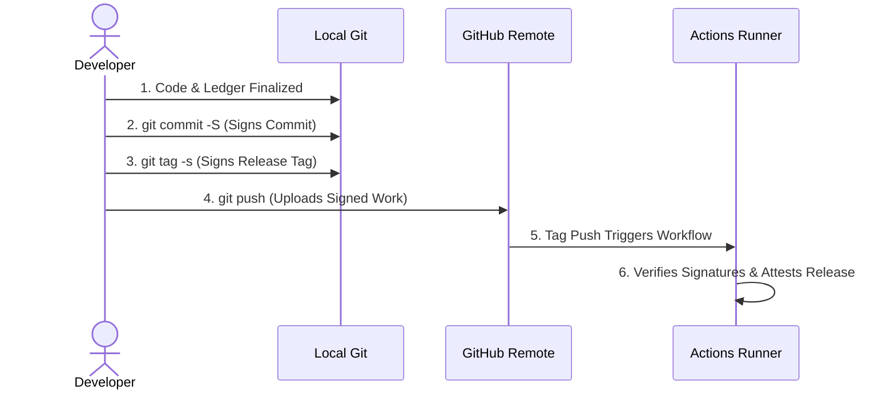

# Git Signatures & Blockchain Identity Integration

Integrating GitHub's native signing infrastructure with our cryptographic YAML blockchain gives you the best of both worlds:
1. **The YAML Blockchain** proves **data integrity and chronological sequence** (exactly what happened and when).
2. **GitHub's Signed Commits or Manifests** prove **non-repudiation and identity** (exactly *who* authorized that change).

The following two architectural patterns demonstrate how to integrate these concepts, ranging from a tight inline integration to an independent, detached signed manifest.

---

## 🛰️ Pattern 1: Detached Signed Manifest (The Anchored Snapshot)

In this approach, our multi-document YAML chain (`chain.yaml`) grows normally as a single file. Alongside it, we maintain a tiny, lightweight manifest file (`chain.sig.yaml`).

Every time a new block is appended to the chain, a GitHub Action or a developer's local Git hook automatically updates this manifest with the latest `meta_hash` and commits it using a **cryptographically signed Git commit** (using GPG, SSH, or Sigstore/Cosign).

### The File Structure

#### **`chain.sig.yaml`**

```yaml
---
manifest_version: "1.0"
target_file: "chain.yaml"
# The absolute latest block anchor from the chain
last_verified_block:
  index: 42
  meta_hash: "a5f86c2e1b4d8f9a3c7e6b5d4c3b2a1f9e8d7c6b5a4f3e2d1c0b9a8f7e6d5c4b"
timestamp: "2026-05-27T22:15:00.000Z"
```

### How It Proves the Actor and the File

```text
[ chain.yaml (The Ledger) ] <--- Contains the full history up to Block 42
         ^
         | (Points to latest hash)
         |
[ chain.sig.yaml (The Anchor) ] 
         ^
         | (Wrapped inside)
[ Signed Git Commit ] ---> Cryptographically tied to a GitHub User Key (e.g., Aaron)
```

1. **Data Integrity**: The verifier reads `chain.sig.yaml`, grabs the `meta_hash`, and confirms it matches the final block in `chain.yaml`. They then traverse the chain backward to index `0`. If a single byte was altered anywhere in the history, the validation fails.
2. **Actor Identity**: The verifier uses the GitHub API (or local Git CLI) to check the GPG/SSH signature of the commit that touched `chain.sig.yaml`.
   - If **Aaron** committed it, Git verifies the commit payload against **Aaron's** public GPG/SSH key registered on GitHub.
   - GitHub marks the commit as **"Verified"**, proving that the person holding **Aaron's** private key explicitly signed off on that exact state of the blockchain.

---

## 🔗 Pattern 2: Inline Commit-Wrapped Blocks (The Continuous Chain)

If you want to bake identity directly into the chain traversal without a secondary file, you can treat GitHub's commit signing signature as an intrinsic metadata field inside each block's `$yaml-chain-meta` section.

When **Bob** appends a block, he doesn't just sign the YAML payload; he generates the commit metadata, signs it with his Git key, and injects that signature artifact directly into the block's `$yaml-chain-meta`.

### The File Structure

#### **`chain.yaml`** (Snippet showcasing a single appended block pair)

```yaml
author: Bob
role: Receiver
---
$yaml-chain-meta:
  version: 1.0.0
  block_index: 3
  timestamp: "2026-05-27T22:30:00.000Z"
  hashing_strategy: raw
  data_hash: "f67c29e61bd64de587be11cb42ab85c96752d8a41bfbe888b209e25d0c7a10ea"
  prev_meta_hash: "fa123456bde890acfa1234567d890abcef7a123fbcde890abcef890acba123d4"
  # The signature actor metadata proving non-repudiation
  signature_auth:
    provider: "github-ssh"
    signer_identity: "bob@yaml.company"
    # The actual signature of this block's metadata generated by Bob's local SSH key
    git_signature: |
      -----BEGIN SSH SIGNATURE-----
      U1NIU0lHAAAAAQAAADMAAAALc3NoLXJzYQAAAAMBAAEAAwGBAK3U0mG...
      -----END SSH SIGNATURE-----
  meta_hash: "bcbc7890e8c7d6a5b4a39281c7b6ab5a4df3e2d1cbde98a7bc89d0c2e3ab5689d"
```

### How It Proves the Actor and the File

In this model, our parsing engines (`node-parser`, `ys-parser`, etc.) are extended slightly to handle a dual-verification step:
1. **Chain Link Verification**: The engine ensures `prev_meta_hash` matches Block 2, and calculates the hash of the current metadata block to match `meta_hash`.
2. **Identity Verification**: The engine extracts the `git_signature` string, normalizes the surrounding metadata block, and pipes it directly into `gpg --verify` or `ssh-keygen -Y verify`. It matches this signature against **Bob's** known public keys exported from `https://github.com/bob.keys`.

---

## 🏛️ Architectural Recommendation

For most supply chain security audits, **Pattern 1 (Detached Signed Manifest) is highly recommended** for three reasons:

1. **Preserves Parser Simplicity**: It keeps our four existing parsing engines pristine. They do not need to learn how to interpret cryptography armors or interface with local GPG/SSH keychains; they just parse YAML and calculate SHA-256 hashes.
2. **Demonstrates the "External Trust" Model**: `chain.yaml` can sit in a public, editable development workspace, but `chain.sig.yaml` can be enforced via GitHub branch protection rules—requiring mandatory signed commits and linear history from specific Authorized Approvers (**Aaron**, **Bob**, or **Carol**).
3. **Simulating Failures in a Test Suite**:
   - Have **Eve** modify a payload in `chain.yaml` to fake a vulnerability status.
   - Run the verification script against `chain.sig.yaml`.
   - The script will compute the actual tail of `chain.yaml`, see that it matches the manifest's `meta_hash`, but as it walks backward, it will hit **Eve's** tampered block and fail.
   - If **Eve** tries to rewrite `chain.sig.yaml` to match her new fake hashes, she won't be able to generate a valid Git signature matching **Aaron** or **Bob's** GPG/SSH keys, and the CI/CD pipeline will reject the commit entirely.

---

## 🏁 Developer Release Lifecycle: When & How to Sign

In a production secure software supply chain, a developer signs their work at **two critical checkpoints** on their local workstation before pushing code to the remote repository. This establishes a verified, cryptographically sealed path from the developer's keyboard all the way to the published release.

### Step-by-Step Signing Sequence



#### 1. Signing the Release Commit (Local Commit)
* **When:** Right after finalizing code changes, updating version numbers, or sealing the cryptographic ledger (`chain.yaml`) locally.
* **How:** Add the `-S` flag to sign the commit using your local GPG, SSH, or S/MIME private key:
  ```bash
  git commit -S -m "chore(release): bump version to v1.2.0 and seal ledger"
  ```
* **Why:** This cryptographically anchors your verified identity to the commit payload, proving that the final code state was authorized by you before leaving your machine.

#### 2. Signing the Release Tag (Local Tagging)
* **When:** Immediately after recording the release commit, right before pushing.
* **How:** Create a signed Git tag using the `-s` flag:
  ```bash
  git tag -s v1.2.0 -m "Release v1.2.0"
  ```
* **Why:** In Git, a signed tag creates an independent, immutable cryptographic tag object containing your signature pointing directly to the commit SHA. This acts as the official, tamper-proof seal of approval for the release.

#### 3. Pushing to GitHub (The Hand-off)
* **When:** Once the commit and tag are securely signed.
* **How:** Push both the branch and the new tag to trigger the pipeline:
  ```bash
  git push origin main
  git push origin v1.2.0
  ```

### How the CI/CD Pipeline Validates and Seals Your Release

When you push the signed tag `v*` to GitHub:
1. **Developer Signature Gate:** The runner verifies the GPG/SSH signatures on the commit and tag against a trusted keyring (which our `test-signatures` integration suite simulates).
2. **Natively Compiles Binary:** The runner compiles the code and archives it into `yaml-chain-bin.tar.gz`.
3. **Mints Sigstore Attestation:** The runner uses `actions/attest@v4` to mint an unfalsifiable build provenance attestation for the binary and `chain.yaml` (publishing the metadata signature directly to Sigstore's Rekor transparency log).
4. **Publishes Release:** The runner publishes the assets and ledger to GitHub Releases, closing the loop on an entirely verified, cryptographically secured software supply chain.

